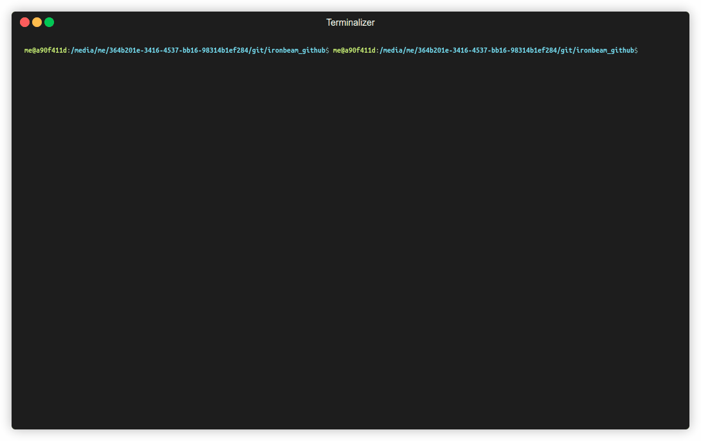

# Pre-requisites

[`python`](https://www.python.org/downloads/), [`hledger`](https://github.com/simonmichael/hledger) and [`just`](https://github.com/casey/just) are used. 
Only `python` is needed to create csv-files. The `justfile` is developed for linux/macOS. It should work with cygwin or similar under
Windows.

# Usage

Save daily account statements from https://trading.certigo.com/ (Acount > Overview > Statements) 
in the `input` folder with the extension `.txt`. Select all text, copy and paste into a text-file.

Run `just iron` to show results or run the commands in `justfile` manually if you cannot use 
`just`.

## Run manually (without `just`)

1. Create an `.out`-file for each type of record: `python3 iron1.py input` (Assuming the text files are in the folder `input`)

2. Create `PURCHASE_AND_SALE.csv`: `python3 iron2.py input/PURCHASE_AND_SALE.out pur`
3. Create `CONFIRMATION.csv`: `python3 iron2.py input/CONFIRMATION.out conf`
